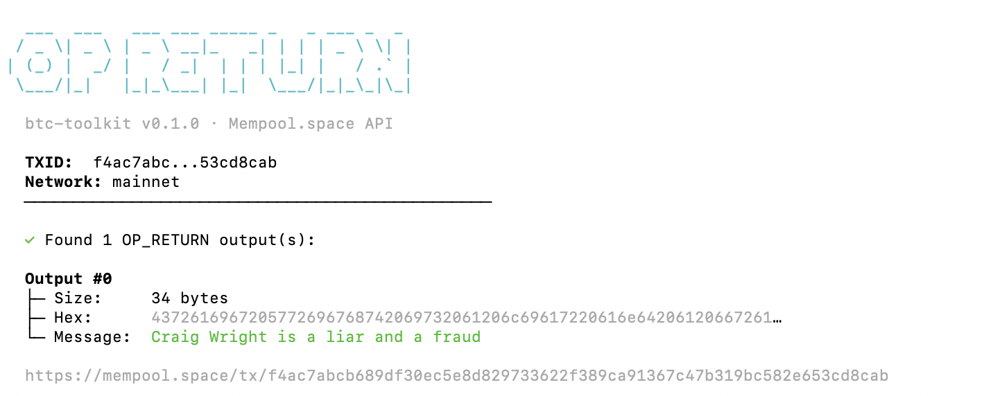
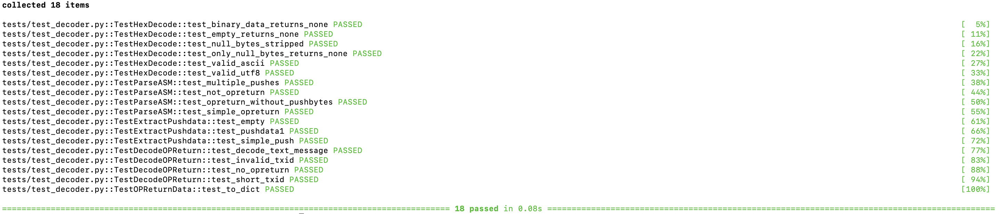

# btc-toolkit

Bitcoin CLI toolkit — zero dependencies, no Bitcoin Core required.

Uses the [Mempool.space](https://mempool.space) public API to query the Bitcoin network directly.

## Phase 1: OP_RETURN Reader

Decode human-readable messages embedded in Bitcoin transactions via `OP_RETURN` outputs.



### Installation

**Requirements:** Python 3.10+

```bash
git clone https://github.com/devdavidejesus/btc-toolkit.git
cd btc-toolkit
pip install -e .
```

### Usage

**Basic — decode OP_RETURN from a transaction:**

```bash
python -m op_return_reader <txid>
```

**JSON output — for scripting and piping:**

```bash
python -m op_return_reader <txid> --json
```

```json
{
  "txid": "f4ac7abcb689df30ec5e8d829733622f389ca91367c47b319bc582e653cd8cab",
  "network": "mainnet",
  "op_return_count": 1,
  "outputs": [
    {
      "txid": "f4ac7abcb689df30ec5e8d829733622f389ca91367c47b319bc582e653cd8cab",
      "vout_index": 0,
      "raw_hex": "4372616967205772696768742069732061206c69617220616e64206120667261756421",
      "decoded_text": "Craig Wright is a liar and a fraud",
      "size_bytes": 34
    }
  ]
}
```

**Raw hex output:**

```bash
python -m op_return_reader <txid> --raw
```

**Testnet:**

```bash
python -m op_return_reader <txid> --network testnet
```

**After pip install:**

```bash
op-return-reader <txid>
```

### Transactions to Try

These are real, verified OP_RETURN transactions on mainnet. Verify each one yourself on [mempool.space](https://mempool.space).

| TXID | Description |
|---|---|
| `f4ac7abcb689df30ec5e8d829733622f389ca91367c47b319bc582e653cd8cab` | "Craig Wright is a liar and a fraud" — 34 bytes ([source](https://armantheparman.com/op_return_old/)) |
| `2033435de7ce307341231e818ed937cd3a5e8597381fd83a7e5b0234f61b38d3` | "learnmeabitcoin" — 75-byte OP_RETURN with null-padded ASCII ([source](https://learnmeabitcoin.com/explorer/tx/)) |

> **Note:** Satoshi's famous "Chancellor on brink of second bailout for banks" message is in the
> **coinbase scriptSig** of the genesis block — NOT in an OP_RETURN output. That's a common
> misconception. This tool reads OP_RETURN outputs only, which is the correct standard mechanism
> for embedding data in Bitcoin transactions (introduced as standard in Bitcoin Core v0.9.0, March 2014).

### How It Works

1. Takes a Bitcoin transaction ID as input
2. Queries the Mempool.space API (no local node needed)
3. Parses `scriptPubKey` to identify `OP_RETURN` outputs (type `op_return` / `nulldata`)
4. Handles `OP_PUSHBYTES` (0x01–0x4b), `OP_PUSHDATA1` (0x4c), `OP_PUSHDATA2` (0x4d) opcodes
5. Attempts UTF-8 decoding; falls back to hex display for binary data (e.g. SegWit commitments)

Zero external dependencies — uses only Python's standard library (`urllib`, `json`, `argparse`).

### Testing



### Project Structure

```
btc-toolkit/
├── op_return_reader/
│   ├── __init__.py       # Package version
│   ├── __main__.py       # python -m entry point
│   ├── cli.py            # CLI interface (argparse)
│   └── decoder.py        # Core decode logic + API client
├── tests/
│   └── test_decoder.py   # Unit tests (mocked API + parser validation)
├── pyproject.toml        # Package config
├── LICENSE               # MIT
└── README.md
```

### What OP_RETURN Is (and Isn't)

OP_RETURN is a Bitcoin script opcode that marks a transaction output as **provably unspendable**. It allows embedding up to 80 bytes of arbitrary data per output (unlimited since Bitcoin Core v30.0, October 2025). Common uses include SegWit witness commitments in coinbase transactions, proof-of-existence timestamps, and protocol identifiers (e.g. OMNI Layer).

This tool does **not** read:
- Coinbase `scriptSig` data (like Satoshi's genesis message)
- Witness field data
- Data embedded via other non-standard methods

## Roadmap

This is Phase 1 of a broader Bitcoin CLI toolkit.

- [x] **Phase 1** — OP_RETURN Reader
- [ ] **Phase 2** — Address Balance Checker
- [ ] **Phase 3** — Fee Estimator (mempool-based)
- [ ] **Phase 4** — Block Info Explorer
- [ ] **Phase 5** — UTXO Set Inspector

All phases follow the same philosophy: **zero dependencies, no Bitcoin Core, verify everything on-chain.**

## Don't Trust, Verify

Every txid, hex value, and technical claim in this README can be independently verified:
- Transaction data: `https://mempool.space/api/tx/<txid>`
- OP_RETURN spec: [learnmeabitcoin.com/technical/script/return](https://learnmeabitcoin.com/technical/script/return/)
- BIP 141 (SegWit commitment): [bitcoin.it/wiki/BIP_0141](https://en.bitcoin.it/wiki/BIP_0141)

## License

MIT — see [LICENSE](LICENSE).

## Author

**Davi de Jesus** — [@devdavidejesus](https://github.com/devdavidejesus)
