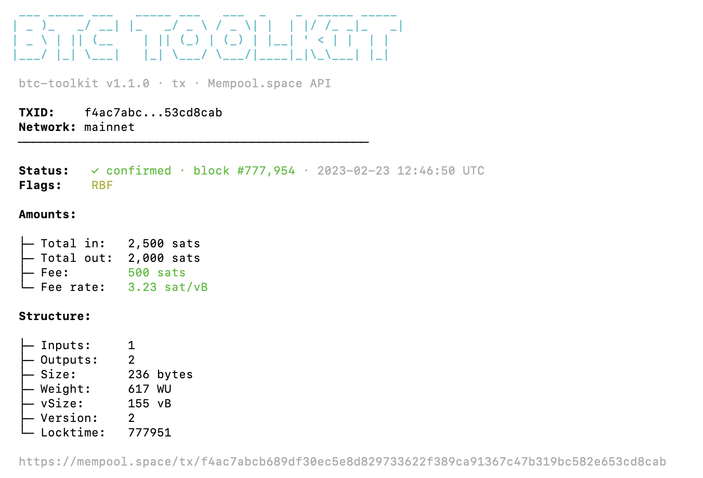
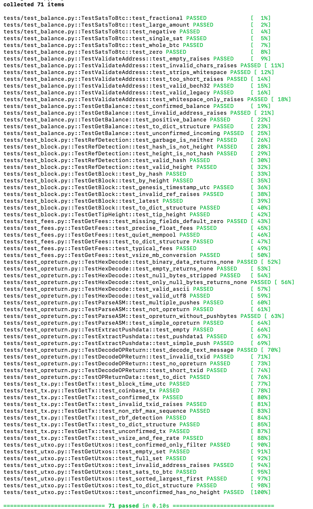

<div align="center">

# ₿ btc-toolkit

**Bitcoin CLI toolkit — zero dependencies, no Bitcoin Core required.**

Query the Bitcoin network directly via the [Mempool.space](https://mempool.space) public API.

[](https://github.com/devdavidejesus/btc-toolkit/actions/workflows/tests.yml)
[](https://github.com/devdavidejesus/btc-toolkit/tags)
[](https://github.com/devdavidejesus/btc-toolkit/blob/main/pyproject.toml)
[](https://github.com/devdavidejesus/btc-toolkit/blob/main/pyproject.toml)
[](LICENSE)

</div>

---

## Commands

| Command | Description | Status |
|---|---|---|
| `btc-toolkit opreturn <txid>` | Decode OP_RETURN messages from a transaction | ✅ Phase 1 |
| `btc-toolkit balance <address>` | Confirmed + unconfirmed balance of any address | ✅ Phase 2 |
| `btc-toolkit fees` | Fee estimation from mempool conditions | Phase 3 |
| `btc-toolkit block <height\|hash>` | Block metadata explorer | Phase 4 |
| `btc-toolkit utxo <address>` | UTXO set inspector | Phase 5 |

## Installation

**Requirements:** Python 3.10+

```bash
git clone https://github.com/devdavidejesus/btc-toolkit.git
cd btc-toolkit
pip install -e .
```

## Usage

### balance — check any address

```bash
btc-toolkit balance 1A1zP1eP5QGefi2DMPTfTL5SLmv7DivfNa
```

Shows confirmed balance, unconfirmed (mempool) balance, and total — in BTC and satoshis. Supports all address types: Legacy (P2PKH), P2SH, SegWit (Bech32), and Taproot.

```bash
# JSON output for scripting
btc-toolkit balance <address> --json

# Testnet
btc-toolkit balance <address> --network testnet
```

BTC conversion uses integer arithmetic (no floats) — satoshi-exact, always.

### opreturn — decode embedded messages

```bash
btc-toolkit opreturn f4ac7abcb689df30ec5e8d829733622f389ca91367c47b319bc582e653cd8cab
```



```bash
# JSON output
btc-toolkit opreturn <txid> --json

# Raw hex only
btc-toolkit opreturn <txid> --raw
```

### Transactions to Try

Real, verified OP_RETURN transactions on mainnet. Verify each one yourself on [mempool.space](https://mempool.space).

| TXID | Description |
|---|---|
| `f4ac7abcb689df30ec5e8d829733622f389ca91367c47b319bc582e653cd8cab` | "Craig Wright is a liar and a fraud" — 34 bytes ([verify on-chain](https://mempool.space/tx/f4ac7abcb689df30ec5e8d829733622f389ca91367c47b319bc582e653cd8cab)) |
| `2033435de7ce307341231e818ed937cd3a5e8597381fd83a7e5b0234f61b38d3` | "learnmeabitcoin" — 75-byte OP_RETURN with null-padded ASCII ([verify on-chain](https://mempool.space/tx/2033435de7ce307341231e818ed937cd3a5e8597381fd83a7e5b0234f61b38d3)) |

> **Note:** Satoshi's famous "Chancellor on brink of second bailout for banks" message is in the
> **coinbase scriptSig** of the genesis block — NOT in an OP_RETURN output. That's a common
> misconception. This tool reads OP_RETURN outputs only, which is the standard mechanism
> for embedding data in Bitcoin transactions (introduced as standard in Bitcoin Core v0.9.0, March 2014).

## Architecture

```
btc-toolkit/
├── btc_toolkit/
│   ├── __init__.py       # Package version
│   ├── __main__.py       # python -m entry point
│   ├── cli.py            # Unified CLI with subcommands
│   ├── api.py            # Shared Mempool.space HTTP client
│   ├── colors.py         # Shared terminal color helpers
│   ├── opreturn.py       # Phase 1 — OP_RETURN decoder
│   └── balance.py        # Phase 2 — Address balance checker
├── tests/
│   ├── test_opreturn.py  # 18 tests (mocked API + parser validation)
│   └── test_balance.py   # 18 tests (sats math + API response parsing)
├── pyproject.toml
├── LICENSE               # MIT
└── README.md
```

Every subcommand shares one HTTP client (`api.py`) — new phases add a module + a subcommand, nothing else.

Zero external dependencies — Python standard library only (`urllib`, `json`, `argparse`).

## Testing

```bash
python -m pytest tests/ -v
```

36 tests, all API calls mocked — the suite runs offline.



## How balance is computed

The Mempool.space `/address` endpoint returns `chain_stats` (confirmed) and `mempool_stats` (unconfirmed), each with `funded_txo_sum` and `spent_txo_sum` in satoshis.

```
confirmed   = chain_stats.funded_txo_sum   - chain_stats.spent_txo_sum
unconfirmed = mempool_stats.funded_txo_sum - mempool_stats.spent_txo_sum
total       = confirmed + unconfirmed
```

This is the same model used by Esplora/Electrs. Don't trust this README — verify against `https://mempool.space/api/address/<address>` yourself.

## Roadmap

- [x] **Phase 1** — OP_RETURN Reader
- [x] **Phase 2** — Address Balance Checker
- [ ] **Phase 3** — Fee Estimator (mempool-based)
- [ ] **Phase 4** — Block Info Explorer
- [ ] **Phase 5** — UTXO Set Inspector

All phases follow the same philosophy: **zero dependencies, no Bitcoin Core, verify everything on-chain.**

## Don't Trust, Verify

Every txid, address, hex value, and technical claim in this README can be independently verified:
- Transaction data: `https://mempool.space/api/tx/<txid>`
- Address data: `https://mempool.space/api/address/<address>`
- OP_RETURN spec: [learnmeabitcoin.com/technical/script/return](https://learnmeabitcoin.com/technical/script/return/)
- Esplora API model: [github.com/Blockstream/esplora/blob/master/API.md](https://github.com/Blockstream/esplora/blob/master/API.md)

## Contributing

Found a bug or want to help with a phase from the roadmap? Open an [issue](https://github.com/devdavidejesus/btc-toolkit/issues) or a PR. Every contribution must keep the core rules: stdlib only, tests mocked, claims verifiable on-chain.

---

<div align="center">

Licensed under [MIT](LICENSE) · Built by [@devdavidejesus](https://github.com/devdavidejesus)

*"Don't Trust, Verify."*

</div>
